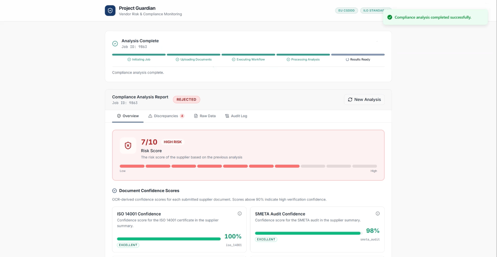
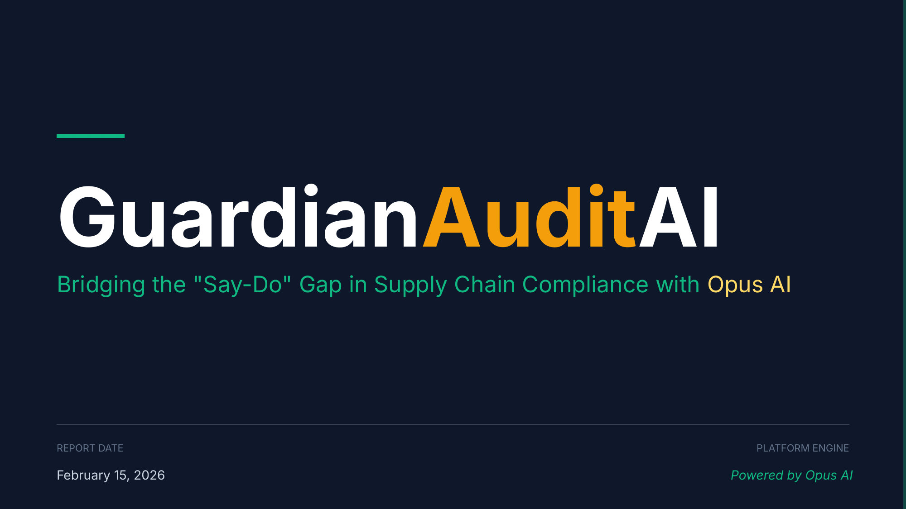
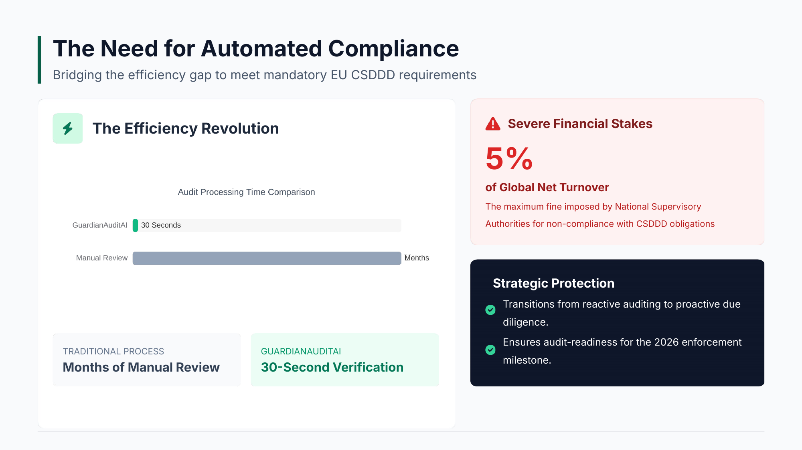
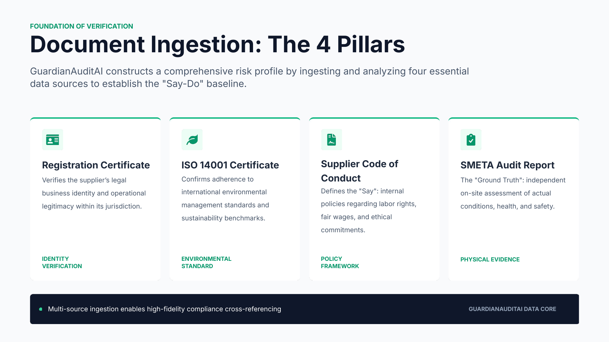
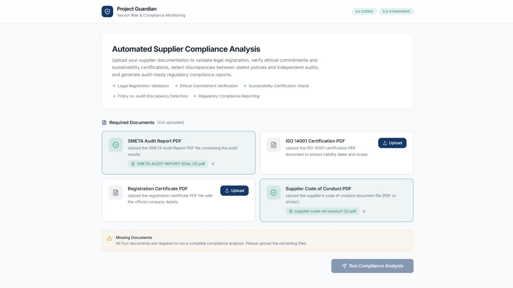
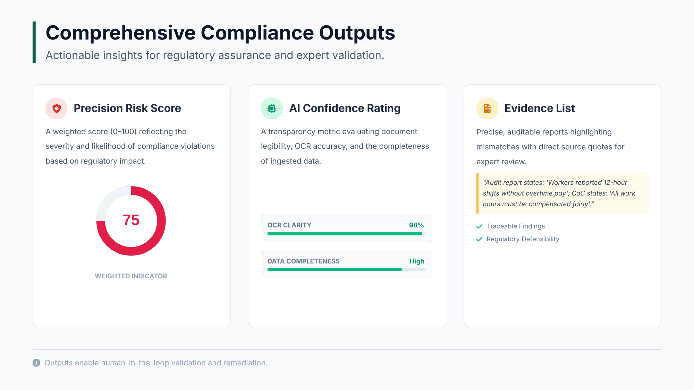
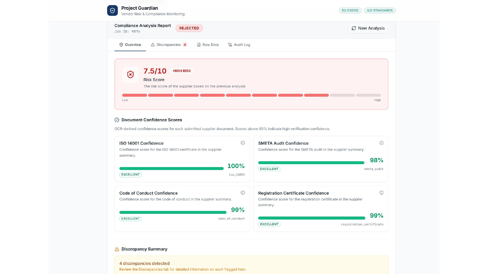
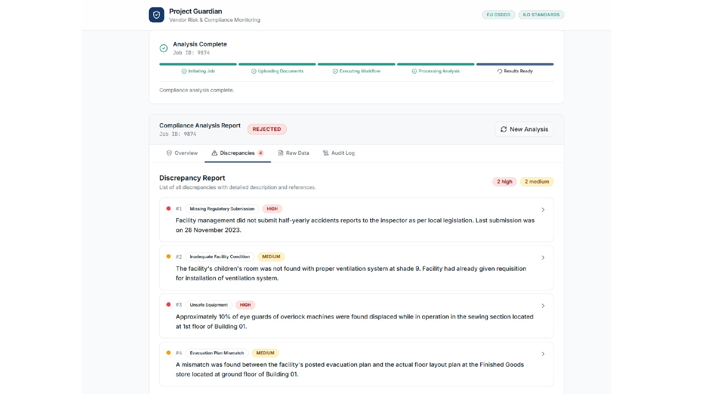
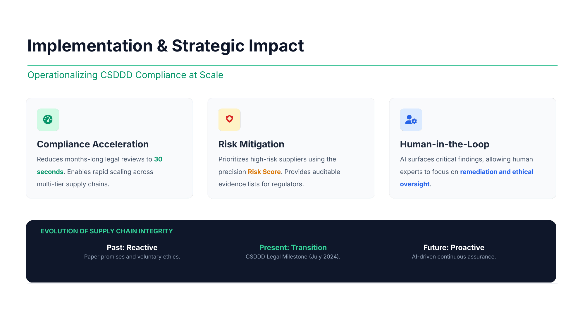
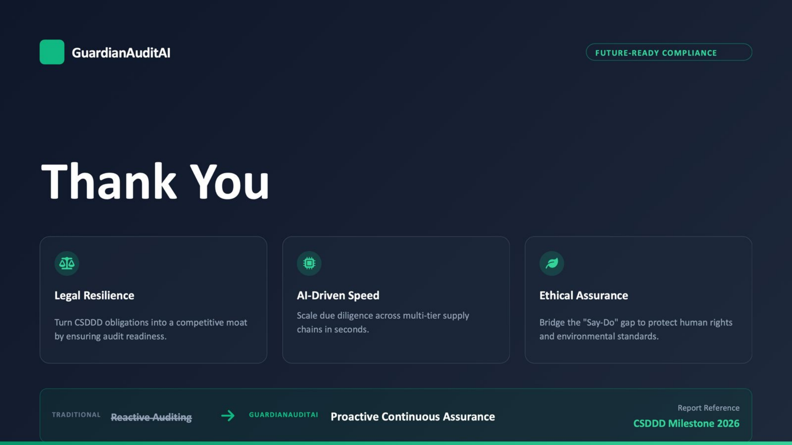

# 🛡️ GuardianAuditAI
### Bridging the "Say-Do" Gap in Supply Chain Compliance

> Turning months-long manual legal reviews into a **30-second automated audit** — powered by Opus AI.

[](https://commission.europa.eu)
[](https://commission.europa.eu)
[](#)
[](#)

---

## 🎬 Demo

<!-- Replace demo-thumbnail.png with a screenshot of your video, and demo.mp4 with your actual video file path in the repo -->
[](assets/demo.mp4)

> **💡 Tip:** Click the thumbnail above to play the demo video. To set this up: add your MP4 as `assets/demo.mp4` in the repo, and drop a screenshot of the video as `assets/demo-thumbnail.png`.

---

## 📽️ Presentation

<table>
  <tr>
    <td width="50%"></td>
    <td width="50%"></td>
  </tr>
  <tr>
    <td width="50%"></td>
    <td width="50%"></td>
  </tr>
  <tr>
    <td width="50%"></td>
    <td width="50%"></td>
  </tr>
  <tr>
    <td width="50%"></td>
    <td width="50%"></td>
  </tr>
  <tr>
    <td width="25%"></td>
    <td width="50%"></td>
    <td width="25%"></td>
  </tr>
</table>

---

## 📖 Overview

**GuardianAuditAI** is an automated Digital Auditor designed to ensure global supply chain integrity. By leveraging the advanced reasoning capabilities of the **Opus AI engine**, the platform identifies discrepancies between a supplier's ethical claims and the physical reality of their factory floor.

As the **July 2026** milestone of the **EU Corporate Sustainability Due Diligence Directive (CSDDD)** approaches, companies face unprecedented legal pressure — including fines of up to **5% of global revenue**. GuardianAuditAI automates what was previously a months-long manual legal process.

---

## 🌍 The Problem: The "Say-Do" Gap

Supply chain compliance has historically relied on *paper promises*. Suppliers sign ethical codes, but actual conditions often remain unverified. The CSDDD transforms these ethics from **"voluntary"** to **"mandatory."**

| | What It Means |
|---|---|
| **The "Say"** | What the supplier promises in their internal policies |
| **The "Do"** | What independent inspectors actually observe at the factory |

GuardianAuditAI closes this gap automatically.

---

## ⚙️ Key Functions

### 1. Document Ingestion — The 4 Pillars

The system requires four specific inputs to build a complete risk profile:

| Document | Purpose |
|---|---|
| 📄 **Registration Certificate** | Verifies the supplier's legal business identity |
| 🌿 **ISO 14001 Certificate** | Confirms adherence to international environmental management standards |
| 📋 **Supplier Code of Conduct (CoC)** | The internal policy defining the supplier's ethical commitments |
| 🔍 **SMETA Audit Report** | The "ground truth" — an independent inspection of actual factory conditions |

### 2. Intelligent Cross-Referencing

The Opus AI agent performs a **Digital Cross-Examination**: it benchmarks SMETA Audit observations against the Supplier CoC and official EU/UN labor standards, including the **ILO's 11 Indicators of Forced Labor**.

### 3. Comprehensive Output

Every submission generates three outputs:

- **🎯 Precision Risk Score (0–100)** — A weighted score based on regulatory severity
- **🤖 AI Confidence Rating** — A transparency metric indicating evaluation reliability based on document clarity and OCR quality
- **📌 Discrepancy Evidence List** — A precise report with direct quotes from source documents (e.g., highlighting where an audit found unpaid overtime that violates the supplier's own Code of Conduct)

---

## 🚀 Technical Architecture

```
┌─────────────────────────────────────────────┐
│              GuardianAuditAI                │
├──────────────┬──────────────────────────────┤
│   Frontend   │  Next.js + Tailwind CSS (v0) │
│   Backend    │  Opus AI Workflow Automation  │
│   Knowledge  │  EU CSDDD + ILO Guidelines   │
│              │  via Opus Work Knowledge Graph│
│ Integration  │  Bi-directional API           │
│              │  (x-service-key auth)         │
└──────────────┴──────────────────────────────┘
```

---

## 📅 The 2026 Roadmap

> **⚠️ Deadline: July 26, 2026** — All EU Member States must have CSDDD fully integrated into national law.

GuardianAuditAI is built to meet the official guidelines scheduled for release in **mid-2026**, ensuring users remain ahead of enforcement dates.

---

## 📄 License

This project is proprietary. All rights reserved.
